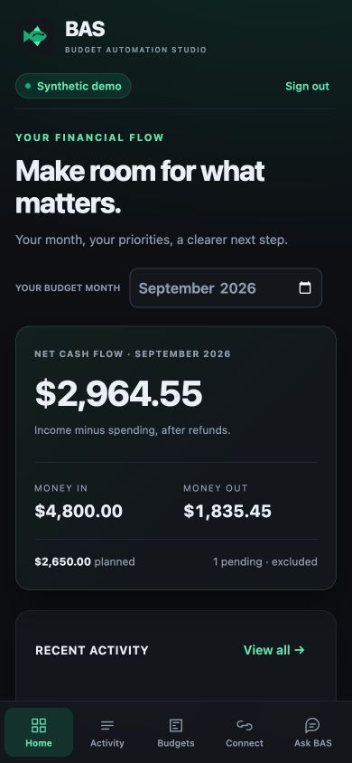
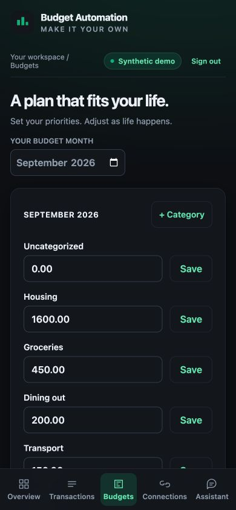
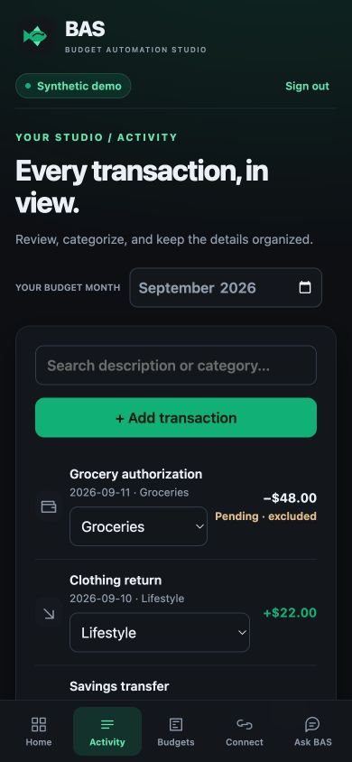
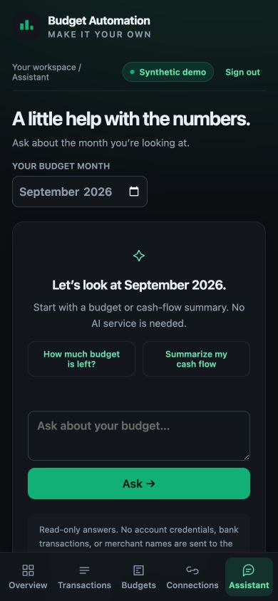
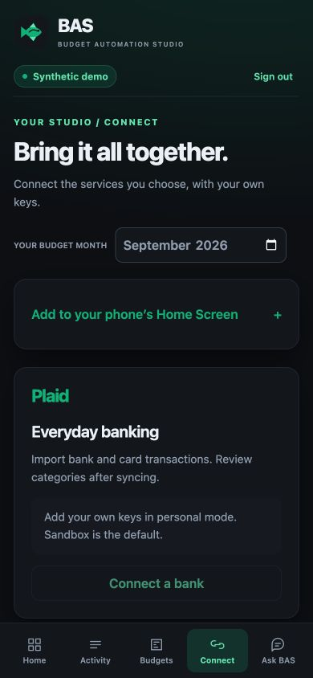
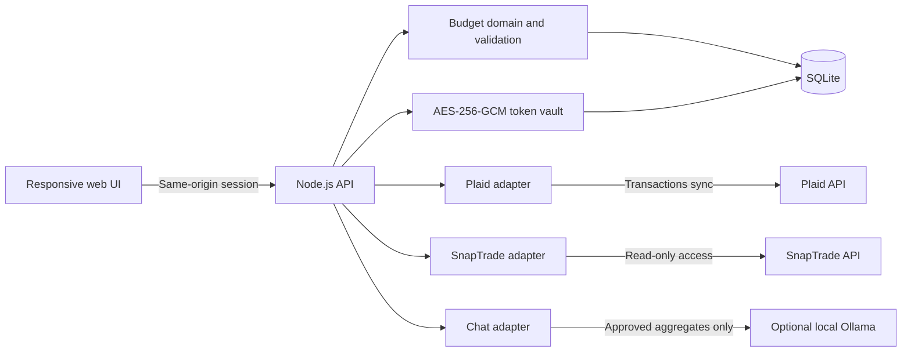

# BAS · Budget Automation Studio


**Find your financial flow.**

BAS (pronounced “bass,” like the fish) is your open-source budget studio. Your budget. Your connections. Your code.

A local-first personal finance starter with a mobile-responsive dashboard, customizable monthly budgets, Plaid transaction ingestion, read-only SnapTrade account values, and an optional local AI assistant.

Try it with synthetic data in minutes. Connect your own services when you are ready. This repository is an independently packaged, generic implementation: it includes no private deployment configuration, financial exports, production credentials, or inherited application history.

<p align="center">
  
</p>

Designed for your phone, with a dark interface and bottom navigation throughout. [Add your deployed web app to your iPhone or Android Home Screen](docs/SETUP.md#7-add-the-web-app-to-your-phone). The local computer-only demo needs a secure remote deployment before it can be reached from a phone.

<details>
<summary>More mobile screens</summary>
<p>
  
  
  
  
</p>
</details>

## Quick start

Install [Node.js 24 LTS](https://nodejs.org/en/download) (24.10 or newer within the 24.x line) and Git. Then:

```sh
git clone https://github.com/Zoraz01/budget-automation-studio.git
cd budget-automation-studio
npm ci
npm start
```

Open **[http://127.0.0.1:4310](http://127.0.0.1:4310)** and choose **Explore the demo**. The demo password is `demo`. No bank account, cloud subscription, or model API key is needed. All sample amounts and descriptions are invented; edits persist in your local demo database.

For a fresh personal workspace, stop the server and run:

```sh
npm run setup
npm start
```

Save the generated local login password. Personal mode creates an empty database with starter categories. It never imports the demo records. Add transactions manually, customize budgets, or follow the [complete setup guide](docs/SETUP.md) to connect your own provider accounts.

## What you can do

| Capability | Included behavior |
| --- | --- |
| Budgets | Monthly category limits, custom expense categories, progress and remaining amounts |
| Transactions | Manual entry, search, category review, refunds, income and transfer classification |
| Plaid | Link flow, server-side public-token exchange, paginated cursor sync, additions/modifications/removals, atomic commits and mutation retry |
| SnapTrade | Personal or Commercial auth, read-only connection portal, imported investment account values and stale/unavailable states |
| Assistant | Deterministic summaries, optional local Ollama, encrypted saved conversations and a history library |
| Mobile UI | Dark theme, bottom navigation, accessible forms, safe areas and home-screen installation metadata |
| Privacy | Loopback-only server, password sessions, encrypted provider tokens, no telemetry or remote fonts |
| Engineering | SQLite persistence, isolated regression tests, dependency lockfile, CI, release-content checks and extension guides |

Provider adapters are covered by mocked regression tests. A successful test run **does not establish a live bank connection or provider approval**. Live access requires your own eligible provider account, keys, permissions and potentially paid plans. This release does not include a trading API, hosted multi-user service, native mobile app, tax engine or financial-advice service.

## Architecture



The browser never receives provider secrets. Plaid batches are fully fetched before their transactions and cursor are committed together. SnapTrade values remain separate from budget cash flow, avoiding accidental double counting. Chat consumes the same server-computed budget summary used by the UI and has no database, SQL, execution or mutation tools.

The implementation uses **JavaScript ES modules, Node.js 24, built-in SQLite, native HTTP/fetch, semantic HTML and CSS**. There is no front-end build step. The official SnapTrade SDK is the only direct runtime dependency. The small module layout is intended to make it practical to replace the UI framework, add a provider or introduce a different persistence layer.

## Make it yours

- Add categories and change monthly limits directly in **Budgets**.
- Set the currency before adding personal data; nine two-decimal currencies are supported.
- Change colors, spacing, breakpoints and typography in [`web/style.css`](web/style.css).
- Extend provider normalization in [`server/providers/`](server/providers/).
- Add a chat provider behind the narrow [`answer()` interface](server/providers/ai.mjs).
- Follow [architecture and extension notes](docs/ARCHITECTURE.md) and the [API reference](docs/API.md).

## Development

```sh
npm run dev             # Restart Node when server code changes; reload browser for UI changes
npm run check:format    # Verify consistent source formatting
npm test                # Domain, persistence, provider and HTTP regression tests
npm run check:release   # Inspect allowlisted tracked content for publication hazards
npm audit --omit=dev    # Check current dependency advisories
```

Node 24 currently labels `node:sqlite` experimental. The project pins its supported Node major and uses its synchronous SQLite API for a single personal workspace. The prototype favors small, understandable modules; larger deployments need a database and request-concurrency design appropriate to their workloads.

## Documentation

- [BAS name and logo](docs/BRAND.md)

- [Setup and provider connections](docs/SETUP.md)
- [Architecture, semantics and customization](docs/ARCHITECTURE.md)
- [API reference](docs/API.md)
- [Verification evidence and limits](docs/VALIDATION.md)
- [Security model and vulnerability reporting](SECURITY.md)
- [Contributing](CONTRIBUTING.md)
- [Changelog](CHANGELOG.md)

## Portfolio description

> Built an open-source personal finance starter with mobile-responsive budgeting, atomic Plaid transaction synchronization, read-only SnapTrade integration, encrypted token storage, and an optional local AI assistant constrained to budget aggregates.

Describe live-provider operation, adoption and production performance only when you have evidence from your own deployment. This starter demonstrates the implementation and architecture; its demo data is not a record of real financial results.

## License

[MIT](LICENSE). Provider accounts, APIs, SDKs and models remain subject to their own terms. This project is not affiliated with or endorsed by Plaid, SnapTrade or Ollama.

## Maintaining the companion repositories

Follow [AGENTS.md](AGENTS.md) for paired feature development and privacy review. [Feature parity](docs/FEATURE-PARITY.md) tracks generic adaptations and outstanding gaps.

### Detailed mobile redesign preview

See [the design package](docs/design/README.md) for every feature/chart contract, saved AI conversation design and home-screen mobile acceptance plan. The preview uses invented data and does not change the running application.

### Saved conversations

Use **Conversations** in Ask BAS to resume saved threads. History survives reload and server restart. See [history setup, encryption keys and recovery](docs/CHAT-HISTORY.md); earlier tab-only messages cannot be recovered automatically.

The fish artwork is also the bookmark and Home Screen icon. If an existing shortcut retains an older icon, remove that shortcut and add it again from the app’s HTTPS address.
