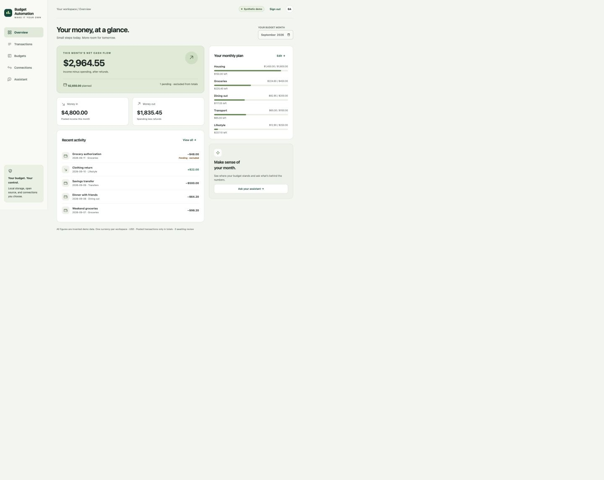

# Release verification

## v0.1.0 — 2026-09-11

Validation used a new standalone source tree, a synthetic demo database and mocked provider responses. The private application's source history, configuration, databases, exports and deployment scripts are not part of this release.

| Check | Evidence |
| --- | --- |
| Regression tests | `npm test`: 34 tests passing locally on Node 24.10.0 |
| Dependency advisories | `npm audit --omit=dev`: zero known vulnerabilities at the time checked |
| Source formatting | `npm run check:format` |
| Secret scan | Gitleaks 8.30.1: no leaks found in the staged release diff |
| Release content | `npm run check:release`, plus manual source/asset review |
| Desktop UI | Dashboard checked at 1024px and 1440px widths |
| Tablet UI | Dashboard checked at 768px width |
| Mobile UI | Dashboard, connection states, transaction search and entry checked at 375px width |
| Persistence | Changed a demo budget through the browser, verified updated values, then restored its original limit |
| Manual entry | Submitted a synthetic transaction through the mobile form and found it in the selected month |
| Assistant | Deterministic answer matched dashboard/category totals without an AI provider |
| Overflow | Document width matched viewport at 375, 768, 1024 and 1440px |
| Browser diagnostics | No captured console errors or warnings after final dashboard reload |

[Mobile synthetic demo screenshot](mobile.jpg)

## Regression coverage

- Exact decimal-to-cent input, invalid dates and unsupported currencies.
- Income reversals, expense refunds, transfers, pending/removed exclusions, category budgets and review counts.
- AES-GCM tamper detection, wrong-key rejection and connection-context binding.
- Personal configuration validation and unconditional demo-provider disabling.
- SQLite batch rollback and idempotent synthetic seed.
- Plaid idempotent upserts/removals, later-page failure rollback, pagination-mutation restart, currency rejection and preservation of user categories.
- Conservative treatment of loan payments and provider transfer labels.
- SnapTrade auth-mode construction, no Personal user registration, read-only portal requests, portal-host validation, missing/foreign values and stale-account preservation.
- AI context allowlisting, deterministic offline summaries and rejection of cloud-labeled model names.
- HTTP session requirements, cookie properties, logout, Host/Origin checks, login throttling, content limits and private-file protection.

## What remains unverified

No real Plaid item was connected, no SnapTrade financial account was accessed, and no local or hosted model inference was run. Adapter tests use synthetic fixtures. These tests cannot validate provider account eligibility, billing, API approval, institution-specific OAuth, mobile provider redirects, or actual model quality.

Screenshots use a browser viewport rather than a physical phone. There is no native app build, app-store submission, public live-data deployment, security certification, penetration test or multi-user acceptance claim. Cross-platform CI results are available in the repository's Actions tab after publication; this local record does not imply those jobs already ran.

Advisory results are time-sensitive. Content pattern checks are partial evidence and do not prove the absence of every possible private datum or vulnerability. Review changes and rerun checks for each release.
