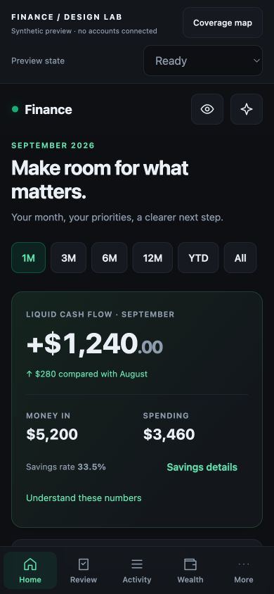
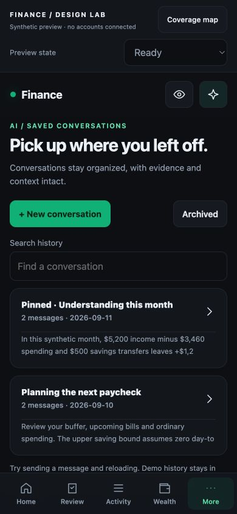
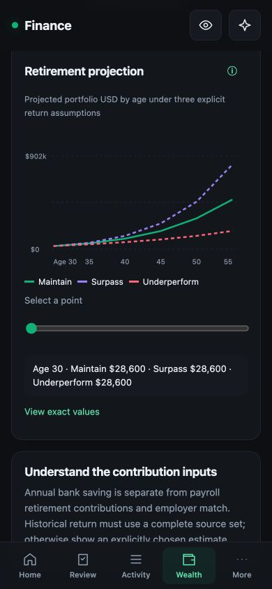

# Design preview validation

Checked 2026-09-11 against the synthetic static preview. This is browser QA of a proposal, not production or physical-phone acceptance.

- Navigated the 19-screen design, including the More directory and saved conversation route. The 18 content destinations measured at 390px had no document-level horizontal overflow.
- Rendered all 12 chart examples across Home, Forecast, Trends, Budgets, Wealth, Holdings, Debt and Retirement. Checked a retirement point selector and its three scenario readout; exact-value alternatives are present.
- Home and the conversation library also fit a 360px viewport without horizontal overflow.
- Exercised loading, empty, error, stale, offline and session-expired recovery selections and returned to ready.
- Created a synthetic conversation and sent a deterministic reply, reloaded, and reopened the saved messages. Renamed, pinned, archived and restored that conversation. This verifies local demo storage only.
- Searched the feature coverage map for refund flows. Submitted an invalid category split and verified that the sheet remained open with the exact-total error.
- Inspected dark 390×844 screenshots of Home, conversation library and retirement charts. Browser console inspection returned no warnings or errors.
- JavaScript syntax and formatting checks cover the preview assets. The public release checks also inspect staged files and an explicit screenshot allowlist.

Not measured here: physical iPhone/Android installation, real keyboard/safe-area behavior, OS eviction, cross-device chat history, authenticated server storage, live provider flows, performance budgets, screen-reader or 200% text acceptance. Follow MOBILE-WEB-APP.md and CHAT-HISTORY.md before implementation release. Forms and most financial calculations remain labeled demonstrations.

## Screenshots

All values, conversations and names were invented. No personal application screenshot was used.

| Home | Saved AI conversations | Chart detail |
|---|---|---|
|  |  |  |
